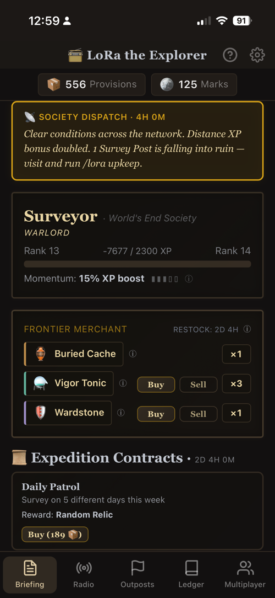
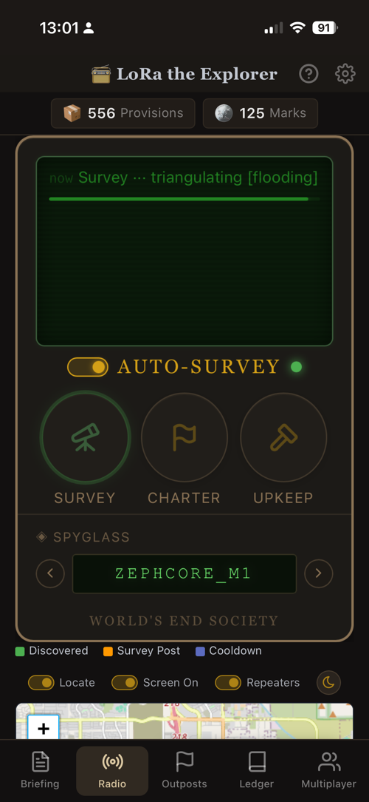
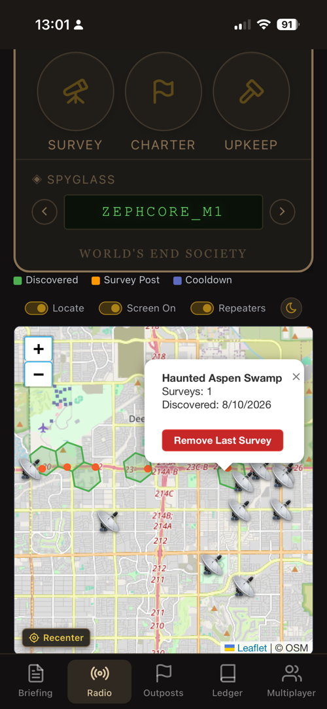
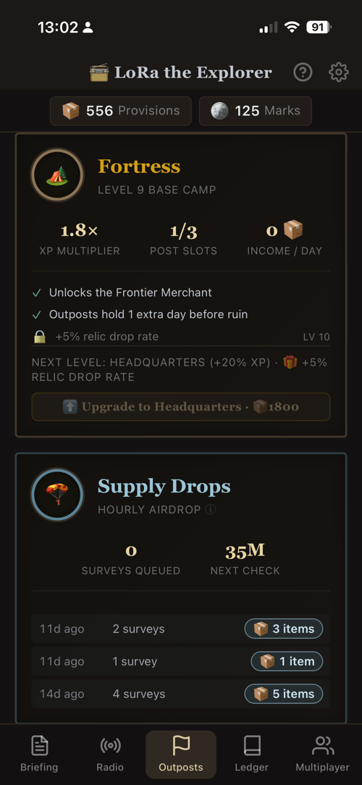
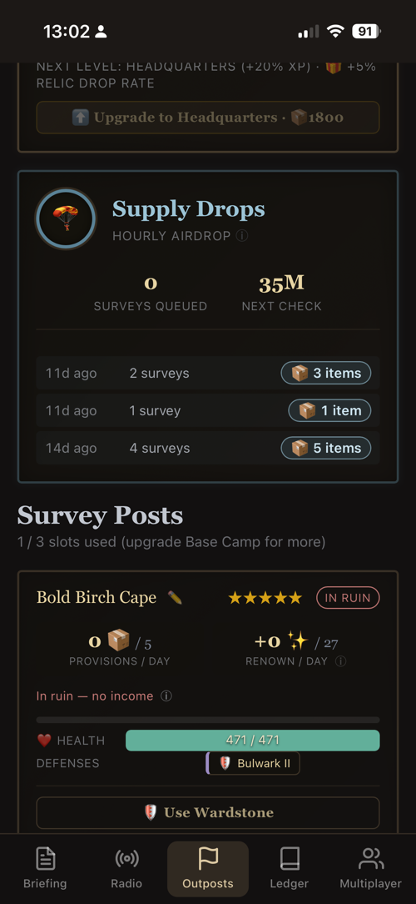
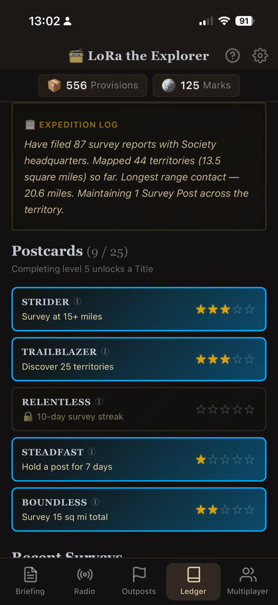
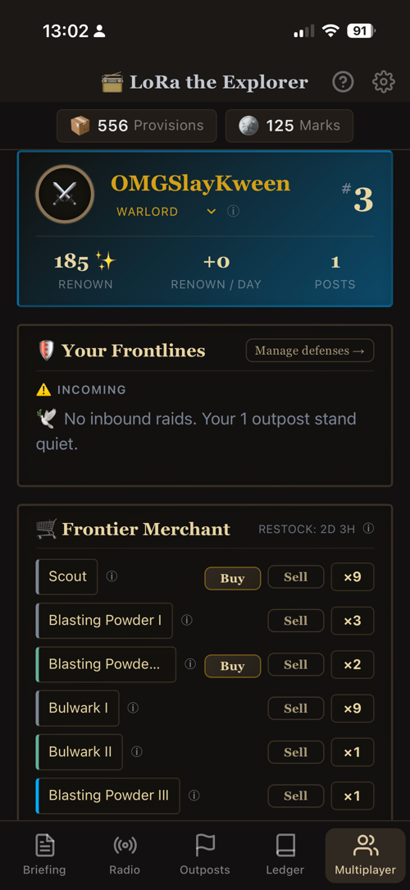
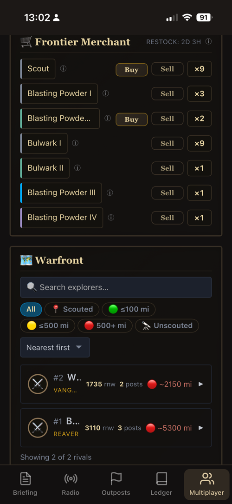

# LoRa the Explorer

A location-based exploration RPG you play over long-range **LoRa radio**. Walk out into the real
world, survey the ground you cover, build a network of outposts, and grow from a lone surveyor into a
ranked member of the World's End Society.

It runs as a small, self-hosted web app that is happy on a Raspberry Pi or any always-on computer,
and installs three ways: **Docker**, a **Windows installer**, or **from source** (Python 3.12+).

**Single-player is the whole game.** Surveying, outposts, upgrades, weekly contracts, the merchant,
relics, achievements, and ranks all work on their own and send nothing to anyone. **Multiplayer is
entirely opt-in:** join the shared war ledger to appear on a leaderboard, scout rival explorers, and
raid their outposts, sharing only a coarse, roughly 50-mile location.

> **The setting:** the World's End Society, a guild of surveyors mapping what is left of the world.

## A look around

The dashboard is phone-friendly and installs to your home screen like an app. Its tabs run left to
right along the bottom: Briefing, Radio, Outposts, Ledger, and Multiplayer.

<table>
  <tr>
    <td width="25%"><br><sub><b>Briefing.</b> Your home screen: currencies, the daily dispatch, your rank, the merchant, and contracts.</sub></td>
    <td width="25%"><br><sub><b>Radio.</b> The live feed and the Survey, Charter, and Upkeep actions you use in the field.</sub></td>
    <td width="25%"><br><sub><b>Map.</b> The territory you have discovered and the mesh repeaters around you.</sub></td>
    <td width="25%"><br><sub><b>Outposts.</b> Grow your base camp to unlock perks, slots, and bigger rewards.</sub></td>
  </tr>
  <tr>
    <td width="25%"><br><sub><b>Survey Posts.</b> Outposts that earn for you passively, as long as you keep them maintained.</sub></td>
    <td width="25%"><br><sub><b>Ledger.</b> Your expedition stats and the achievements you have unlocked.</sub></td>
    <td width="25%"><br><sub><b>Multiplayer.</b> Your standing on the shared war ledger and your outpost defenses.</sub></td>
    <td width="25%"><br><sub><b>Warfront.</b> Scout rival explorers and raid their outposts. Distances stay deliberately coarse.</sub></td>
  </tr>
</table>

## How to play

You explore in the real world and manage everything else from the dashboard. In the field you carry
your **spyglass** (your handheld LoRa device with GPS) and, usually, your phone. There are two ways to
take an action, and you can mix them freely.

**From the dashboard (recommended).** Carry your phone alongside your spyglass and use the **Radio
tab** to Survey, Charter, or Upkeep with a tap. This is the lightest on the mesh: the only thing that
crosses the radio is the quick GPS exchange between your server and your spyglass (about two messages
over the air). The tap and the result travel over your home network, so this needs your phone to be
able to reach your server.

**Radio-only (the off-grid fallback).** When you have no connection to your server at all, send the
same actions as plain text messages straight from your spyglass over the mesh (`/lora survey`, and so
on). Now everything crosses the radio: your command in, the GPS exchange, and the reply back out. That
is roughly twice the mesh traffic (around five messages over the air), but it needs nothing but the
radio. Either way, the app paces and budgets its own transmissions to stay a light, well-behaved
neighbour on your local mesh (see [Responsible LoRa mesh usage](#responsible-lora-mesh-usage)).

```
Dashboard (recommended):  phone tap ─(home network)─> server ─(LoRa: GPS only)─> spyglass
Radio-only (fallback):    spyglass ─(LoRa: command, GPS, reply)─> companion node ─> server
```

Either way, the server works out which territory your GPS puts you in, pays out the rewards, and
updates the dashboard. Only the actions that need to prove your location ever touch the radio;
everything else (maps, upgrades, the merchant, multiplayer) happens on the dashboard.

## Game mechanics

**Explore and earn**

- **Survey** the territory you are standing in. Every survey earns provisions and survey marks, and
  reaching somewhere new pays a discovery bonus. Territories are about a third of a square mile each.
- **Keep a streak going.** Surveying on consecutive days builds Momentum for an XP bonus.
- **Uncover relics** while surveying: rare artifacts, hidden until you find them, each with its own
  use to discover.

**Build and grow**

- **Charter Survey Posts:** permanent outposts at real locations away from home that earn provisions
  passively. Level them up, and run **upkeep** on site to keep them out of ruin.
- **Upgrade your Base Camp** through ten levels to raise your XP multiplier, unlock more outpost
  slots, and open perks like the Frontier Merchant.
- **Climb the ranks,** complete weekly **Expedition Contracts**, chase 25 **postcard achievements**
  that award display titles, and spend at the **Frontier Merchant** as it restocks each week.

**Optional multiplayer (opt-in)**

- **Join the war ledger** to appear on a **renown leaderboard** built from the outposts you hold.
- **Scout rivals** to reveal an outpost's strength, then **raid** it with attack munitions. The
  Warfront is **global**: you can attack any explorer on the ledger, anywhere. Distance sets a raid's
  travel time, so a nearby target is struck quickly while a distant one gets far more warning of your
  incoming attack.
- **Defend** your own outposts with defensive gear, or make one dormant and unraidable for a time.
- **Earn combat titles** like Warlord for topping the Warfront. Only a coarse location and anonymous
  outpost tokens ever leave your server.

## Getting started

### What you'll need

- **A companion radio node on the MeshCore network** (running MeshCore or a compatible firmware such
  as ZephCore). This is the base station at home that receives your radio messages, connected to the
  game server over Wi-Fi, USB, or Bluetooth. A Heltec V3 or similar works well.
- **A handheld LoRa device with GPS** to carry in the field (your **spyglass**), also on the MeshCore
  network, such as a ThinkNode M1, with location sharing turned on.
- **Somewhere to run the game server.** Any always-on computer or a Raspberry Pi. On Windows you do
  not need anything extra (see the Windows option below).

### Install

Pick the option that matches where you want to run the server.

**Docker (Linux, macOS, Raspberry Pi, or Windows).** The recommended way:

```bash
docker run -d --name lora-the-explorer -p 1492:1492 -e TZ=America/Phoenix -v /path/to/data:/app/data ghcr.io/hornofabraxas/lora-the-explorer:latest
```

Set `TZ` to your own [timezone](https://en.wikipedia.org/wiki/List_of_tz_database_time_zones). It
sets the clock shown in radio replies, so you can tell a fresh reply from a stale one. Anything the
game resets on a schedule (the daily survey limit, the dispatch) runs on UTC and is unaffected.

**Windows, without Docker or Python.** Download the `LoRaTheExplorer-Setup-X.Y.Z.exe` installer from
the [releases page](https://github.com/hornofabraxas/lora-the-explorer/releases). It adds a Start
Menu shortcut and runs as a system-tray app: right-click the tray icon for **Open Dashboard**, **Open
Log Folder**, or **Quit**. Your data (including your survey history, so treat it as sensitive) lives
in `%LOCALAPPDATA%\LoRaTheExplorer\` and is **not** removed by uninstalling.

The installer is unsigned, so Windows SmartScreen will warn you on first run. This is a solo hobby
project without a code-signing certificate, not a real threat. Click **More info**, then **Run
anyway** if you trust the source, or build it yourself from `packaging/windows/`.

**From source (Python 3.12 or newer):**

```bash
python -m venv .venv && .venv/bin/pip install -e ".[dev]"
.venv/bin/python -m lora_explorer
```

### First run

Open `http://localhost:1492` and follow the setup wizard. It walks you through choosing a password
(or single sign-on), connecting your companion radio, and dropping a pin for your home base. On your
phone, use your browser's "Add to Home Screen" to install the dashboard like an app. Then head
outside and take your first survey.

## Field commands

The Radio tab does these with a tap, and is the usual way to play. You can also send them as plain
text from your spyglass when you are playing radio-only:

| Command | What it does |
|---|---|
| `/lora survey` | Survey the territory you are standing in |
| `/lora charter` | Begin building a Survey Post here |
| `/lora <name>` | Name the post, completing the charter |
| `/lora upkeep` | Tend a Survey Post, resetting its ruin timer |

## Privacy & your data

**Please read this before you deploy it.**

Your install's database holds **a detailed history of where you have physically been**: your home
coordinates, every survey's location, and every place you have discovered.

- **You are responsible for your own instance.** If you host it for other people, the responsibility
  for their data is yours.
- **Do not expose the dashboard to the open internet** without a password, and treat backup files as
  sensitive. A backup is your full location history.
- **Single-player sends nothing anywhere.** No telemetry, no analytics, no phone-home.
- **Multiplayer is opt-in.** It sends only a coarse location snapped to a roughly 50-mile grid, plus
  anonymous outpost tokens. It never sends your precise location or your survey history.
- **The update check is opt-in and off by default.** When on, it is a plain request to GitHub's
  public release list with no personal data attached.
- **The hosted multiplayer service is 18+.**

Full detail: **[PRIVACY.md](PRIVACY.md)** · **[TERMS.md](TERMS.md)** · **[SECURITY.md](SECURITY.md)**

## Play safely

This game asks you to walk around real places. **Never play while driving.** Watch your
surroundings, do not trespass, and follow local law, including the radio regulations that apply to
LoRa in your country. Your safety and your compliance are your own responsibility.

## Multiplayer service

The hosted war ledger lives at `lora.nukeradio.net` and is **invite-only** while the game is in
alpha. The service is open source too, so you can read exactly what it does with the coarse data you
send it, or run your own. See the companion repo,
[`lora-worker`](https://github.com/hornofabraxas/lora-worker).

## Updating

**Docker:** the `:latest` tag tracks the newest build. Pull it again (`docker compose pull && docker
compose up -d`, or Force Update on Unraid) to update. Tagged versions like `v0.3.0` are pinned and
published separately if you prefer a fixed version over the rolling edge.

**Windows:** download and run the newer installer from the releases page. It installs over the old
version in place.

**Checking for updates:** Settings has a manual "Check now" button, plus an opt-in daily automatic
check that is off by default. Both are a plain request to GitHub's public release list with no
personal data attached. If you play multiplayer and the service has moved past what your version can
talk to, you will see an "Update required" banner. Local play keeps working either way.

## Responsible LoRa mesh usage

LoRa mesh airtime is a shared, finite resource, and this game is built to be a light, well-behaved
neighbour on whatever mesh you run it on. The app manages its own radio use for you, with several
safeguards working together:

- **A per-explorer survey cooldown.** Successful surveys are spaced at least 35 seconds apart, which
  is about as fast as a mesh round-trip can answer anyway.
- **Base-station-wide flood spacing.** Flooded messages from all your explorers are serialised at
  least 20 seconds apart, so several spyglasses reporting in at once cannot bunch up.
- **A rolling transmit budget.** The app tracks its own share of airtime and holds back new floods
  when its transmissions pass roughly 1% over a 10-minute window, well under common "busy channel"
  thresholds.
- **Cheap-route-first messaging.** Replies and location requests try a cached direct route before
  falling back to a flood, since a flooded text message is the single most expensive packet.
- **Zero-airtime housekeeping.** Map, status, and repeater lookups on the dashboard query your local
  companion only and never touch the air.
- **Throttled alerts.** Incoming-raid alerts sent over the radio are rate-limited so they cannot spam
  the mesh.

These are automatic and adaptive: the app reads live airtime signals from your companion node and
backs off on its own. There is nothing to configure.

## Community

[Discord](https://discord.gg/EHXemsA2SS) for support, privacy requests, invite codes, and mesh talk.

## License

[MIT](LICENSE) © 2026 hornofabraxas. Third-party credits in [NOTICE](NOTICE).

**LoRa®** is a registered trademark of Semtech Corporation. This project is independent and
unaffiliated, and is not endorsed by or associated with Semtech, the LoRa Alliance, or MeshCore. The
name describes the radio technology the game runs on.
